# Minha Jornada DevOps

Repositório com minhas anotações, scripts e projetos práticos da minha jornada de aprendizado em DevOps. Este espaço serve como minha base de conhecimento e portfólio de estudos.

O objetivo é documentar de forma estruturada os conceitos, ferramentas e culturas que compõem o universo DevOps, SRE e Engenharia de Plataforma.

---

## 📚 Documentação (FAQ)

Todo o conteúdo teórico está na pasta `/docs`.

* [Capítulo 01: Habilidades Essenciais para DevOps e SRE](./docs/01-Habilidades-Essenciais.md)
* [Capítulo 02: O Papel da Programação](./docs/02-O-Papel-da-Programacao.md)
* [Capítulo 03: Comparativo com Desenvolvedores](./docs/03-Comparativo-com-Desenvolvedores.md)
* [Capítulo 04: Preparação para Entrevistas](./docs/04-Preparacao-para-Entrevistas.md)
* [Capítulo 05: O Ciclo de Vida da Entrega](./docs/05-O-Ciclo-de-Vida-da-Entrega.md)
* [Capítulo 06: O Papel da Automação](./docs/06-O-Papel-da-Automacao.md)
* [Capítulo 07: Construção de Pipelines](./docs/07-Construcao-de-Pipelines.md)
* [Capítulo 08: Métricas de Sucesso](./docs/08-Metricas-de-Sucesso.md)
* [Capítulo 09: Mitos e Realidades](./docs/09-Mitos-e-Realidades.md)
* [Capítulo 10: Relação com Agile](./docs/10-Relacao-com-Agile.md)
* [Capítulo 11: Filosofia e Foco Principal (DevOps vs SRE)](./docs/11-Filosofia-e-Foco-Principal.md)
* [Capítulo 12: A Integração com Segurança (DevSecOps)](./docs/12-A-Integracao-com-Seguranca.md)
* [Capítulo 13: O Conceito de "Shift-Left"](./docs/13-O-Conceito-de-Shift-Left.md)
* [Capítulo 14: Comparativo com Engenharia de Plataforma](./docs/14-Comparativo-com-Engenharia-de-Plataforma.md)

## 💻 Projetos Práticos

A pasta `/projetos` contém projetos práticos que aplicam os conceitos estudados.
*(Esta seção será preenchida conforme os projetos forem criados)*

## 🗺️ Meu Roteiro de Aprendizagem Visual

Este fluxograma representa a jornada de aprendizado prático que estou seguindo, baseado em roadmaps da comunidade.

```mermaid
graph TD;
    subgraph "Jornada de Aprendizagem DevOps/SRE"
        %% A direção TD (Top-Down) já é o padrão do graph TD; mas explicitamos para clareza
        
        %% Definição dos Estágios (Mantemos a mesma ordem lógica, mas agora na vertical)
        A(<b>1. Linguagem de Programação</b><br/>Python ou Go)
        B(<b>2. Sistema Operacional</b><br/>Fundamentos de Linux)
        C(<b>3. Redes e Protocolos</b><br/>DNS, HTTP, SSH)
        D(<b>4. Contêineres</b><br/>Docker)
        E(<b>5. Controle de Versão</b><br/>Git & GitHub)
        F(<b>6. Provedor de Nuvem</b><br/>AWS)
        G(<b>7. Infraestrutura como Código</b><br/>Terraform)
        H(<b>8. Gerenciamento de Configuração</b><br/>Ansible)
        I(<b>9. CI/CD</b><br/>GitHub Actions)
        J(<b>10. Servidor Web / Proxy</b><br/>Nginx)
        K((<b>Próximos Passos</b><br/>Aprofundar e criar projetos))

        %% Conexões na ordem vertical
        A --> B;
        B --> C;
        C --> D;
        D --> E;
        E --> F;
        F --> G;
        G --> H;
        H --> I;
        I --> J;
        J --> K;

    end

    %% Styling para deixar o visual mais agradável
    style A fill:#FDF4CD,stroke:#F7D96D
    style B fill:#FDF4CD,stroke:#F7D96D
    style C fill:#FDF4CD,stroke:#F7D96D
    style D fill:#DBEAFE,stroke:#60A5FA
    style E fill:#DBEAFE,stroke:#60A5FA
    style F fill:#D1FAE5,stroke:#34D399
    style G fill:#D1FAE5,stroke:#34D399
    style H fill:#D1FAE5,stroke:#34D399
    style I fill:#D1FAE5,stroke:#34D399
    style J fill:#D1FAE5,stroke:#34D399
    style K fill:#E0E7FF,stroke:#818CF8

```

-----

---
*Este repositório está em constante construção.*